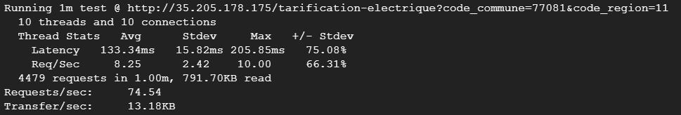
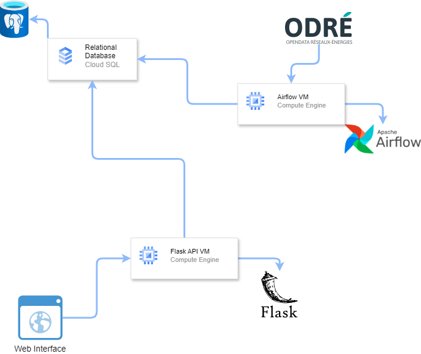
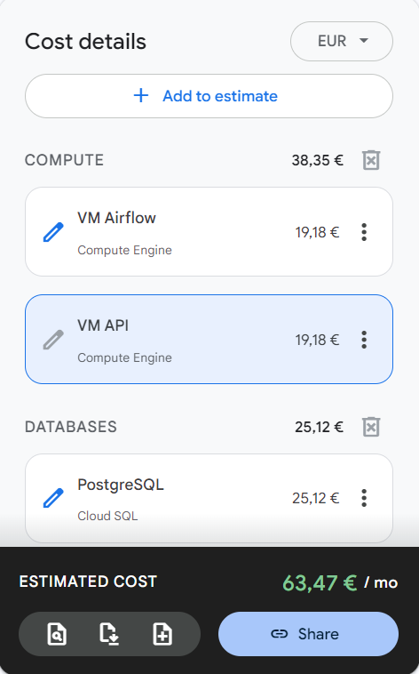

# Tarification électrique - Projet Hands-On Blent.ai

## Introduction

Ce projet a été réalisé dans le cadre d'une formation proposée par Blent.ai. Une entreprise fournisseuse d'énergie souhaite acquérir de nouveaux clients depuis son site Internet. Pour cela, l'entreprise cherche à proposer un formulaire gratuit en ligne permettant à chaque utilisateur visitant le site Web d'évaluer rapidement et simplement sa consommation. Nous allons devoir mettre en place une architecture Google Cloud Platform qui permet de stocker des données et d'utiliser ces données pour estimer le prix qu'un consommateur devra payer selon différents paramètres.

## Base de données

### Source des données

 Nous utilisons deux types de données qui nous viennent de deux sources différentes :
  
- La consommation électrique en temps réel par région, fournie par Opendata Réseaux-Energies, qui nous permettra de calculer la consommation moyenne d'une région pour les 30 derniers jours.
- La consommation annuelle par commune, fournie par Enedis, qui nous permettra de calculer pour une commune l'évolution de sa consommation d'une année à l'autre.

### Base de données Postgres

 Pour stocker ces deux ensemble de données, nous allons utiliser une base de données relationnelles Cloud SQL Postgres sur Google Cloud Platform. Nous avons fait ce choix plutôt qu'une base plus orienté big data / NoSQL car la taille des deux tables dont nous aurons besoin n'est pas très importante.
Nous aurons donc deux tables qui correspondent à nos deux sources de données, et la manière dont on les remplit ne sera pas la même :
  
- Tout d'abord, nous aurons la table qui stocke les consommations annuelles par commune. Cette source de données est mise à jour tous les ans, on la charge donc simplement par un export de l'API Enedis qu'il faudra effectuer chaque année.
- Ensuite, pour la consommation moyenne sur les 30 derniers jours par région, la source est mise à jour toutes les 15 minutes. Nous allons mettre à jour cette table tous les jours à l'aide d'un DAG Airflow afin de maintenir à jour la moyenne des 30 jours.

## Airflow

Nous avons donc besoin de mettre à jour une de nos tables tous les jours. Pour cela, nous créons une VM Compute Engine sur GCP qui nous permettra d'exécuter un DAG Airflow tous les jours à minuit. Ce DAG ira télécharger les nouvelles données de la source et remplacera la table des consommations moyennes sur les 30 derniers jours par région avec les nouvelles données.

## API

### Formule pour estimer la tarification

Pour que les potentiels consommateurs estiment la tarification électrique qui correspond à leur consommation, l'entreprise a mis à disposition une formule que nous allons devoir implémenter.
Cette formule comporte des paramètres donnés par l'entreprise, tel que le prix de base du kwH et le prix du contrat. Elle dépend aussi de paramètres propres à l'individu qu'il devra renseigner, notamment sur le nombre de personnes dans le foyer et sa surface ainsi que son l'utilisation d'électricité (chauffage, eau, etc). Finalement, la formule dépend aussi de deux paramètres, alpha et M qui représentent la consommation locale du logement, c'est à dire la consommation de la commune et de la région où est situé le logement. Ces paramètres seront ceux calculés à partir des données stockées dans notre base de données.

Le paramètre alpha est calculé en faisant le rapport entre la consommation prévue d'une commune à l'année n+1 par rapport à l'année courante. Or, la dernière année disponible dans les donnée Enedis est 2022. Nous utiliserons donc plutôt le rapport entre la consommation d'une commune en 2022 et celle en 2021 pour estimer alpha.

### API Flask

Pour implémenter cette formule d'estimation de tarification, nous créons une VM Compute Engine sur GCP qui nous permettra d'héberger une API Flask. Cette API possède uniquement une requête GET qui renverra l'estimation du prix par mois, à partir des différents paramètres vus dans la section précédente. Elle pourra être appelée depuis une interface web par exemple sur le site de l'entreprise.

### Benchmark

A l'aide la librairie wrk, nous pouvons effectuer un test de benchmark pour voir si notre API respecte les contraintes imposées par l'API. Ces dernières étant que l'API devra être capable de toujours répondre en moins de 6 secondes, même en situation tendue. Voici les résultats que nous obtenons, qui nous montre que la contrainte est largement respectée.

## Conclusion

### Architecture
Nous pouvons modéliser l'architecture de ce projet avec ce diagramme.

### Estimation des coûts

Une des contraintes à respecter pour l'entreprise était que l'implémentation de ce projet sur un service Cloud ne coûte pas plus de 100 euros par mois. On peut vérifier que cette contrainte est respectée grâce au calculateur de coûts de Google Cloud Platform. On rentre les informations des éléments nécessaires pour le projet avec leurs spécifications, et on se rend donc bien compte qu'on est juste dans le budget.

